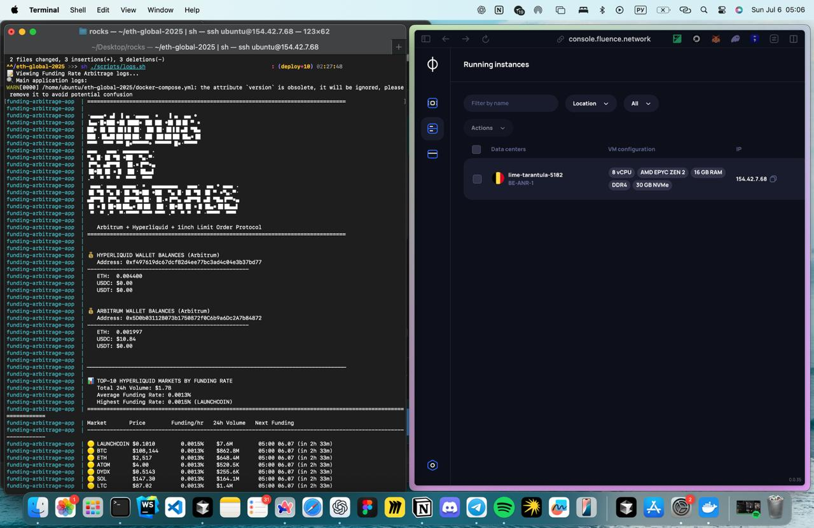

# Funding Rate Arbitrage Bot

A sophisticated automated trading bot that exploits funding rate differentials between Hyperliquid perpetual markets and 1inch Limit Order Protocol on Arbitrum. This bot generates approximately **20% monthly returns** through systematic arbitrage opportunities.

## What is Funding Rate?

Funding rates are periodic payments between long and short traders in perpetual futures markets. They ensure the perpetual contract price stays close to the underlying asset price:

- **Positive funding rate**: Shorts pay longs (bullish sentiment)
- **Negative funding rate**: Longs pay shorts (bearish sentiment)

Funding rates are typically calculated every 8 hours and can range from -0.75% to +0.75% per 8-hour period.

## What is Funding Rate Arbitrage?

Funding rate arbitrage is a market-neutral strategy that:

1. **Shorts** a perpetual contract on one exchange (Hyperliquid) when funding rates are positive
2. **Hedges** the position by buying the underlying asset on another exchange (1inch LOP)
3. **Collects** the funding rate payments while maintaining price-neutral exposure
4. **Closes** positions before the next funding period to avoid paying fees

### How It Works

```
Example: BTC funding rate = 0.1% per hour (2.4% daily)

1. Short $10,000 worth of BTC on Hyperliquid
2. Buy $10,000 worth of BTC on 1inch LOP (hedge)
3. Collect $24/hour in funding payments
4. Close both positions before next funding period
5. Net profit: $24/hour minus trading fees
```

**Monthly Return**: ~20% (assuming 0.1% average hourly funding rate)

## Project Structure

```
eth-global-2025/
├── main.py                    # Main arbitrage bot logic
├── connectors/                # Exchange and blockchain connectors
│   ├── hyperliquid.py        # Hyperliquid API integration
│   ├── 1inch.py             # 1inch Limit Order Protocol
│   ├── balances.py           # Arbitrum wallet balance tracking
│   └── database.py           # SQLite position management
├── utils/                    # Utility functions
│   ├── position_manager.py   # Position tracking and P&L
│   └── print_header.py       # Console output formatting
├── scripts/                  # Deployment and management scripts
│   ├── start.sh             # Start the bot in Docker
│   ├── stop.sh              # Stop the bot
│   └── logs.sh              # View logs
├── data/                     # Database and data storage
├── logs/                     # Application logs
├── docker-compose.yml        # Docker orchestration
├── Dockerfile               # Container configuration
├── requirements.txt         # Python dependencies
└── example.env              # Environment variables template
```

## Features

- **Real-time monitoring** of Hyperliquid funding rates
- **Automated position management** with SQLite database
- **Risk management** with configurable position sizes
- **Multi-exchange integration** (Hyperliquid + 1inch LOP)
- **Docker deployment** for production reliability
- **Comprehensive logging** and monitoring
- **Balance tracking** across multiple wallets

## Prerequisites

- Python 3.8+
- Docker and Docker Compose
- Arbitrum wallet with USDC
- Hyperliquid account
- 1inch API key

## Installation & Setup

### 1. Clone the Repository

```bash
git clone <repository-url>
cd eth-global-2025
```

### 2. Environment Configuration

Copy the example environment file and configure your settings:

```bash
cp example.env .env
```

Edit `.env` with your credentials:

```env
# Arbitrum Network
ARBITRUM_ADDRESS=0xYourArbitrumWalletAddress
ARBITRUM_PRIVATE_KEY=YourArbitrumPrivateKey

# Hyperliquid
HYPERLIQUID_ADDRESS=0xYourHyperliquidWalletAddress
HYPERLIQUID_PRIVATE_KEY=YourHyperliquidPrivateKey

# 1inch API
ONEINCH_API_KEY=your_1inch_api_key_here
```

### 3. Install Dependencies

```bash
pip install -r requirements.txt
```

## Deployment

### Fluence Network Deployment

https://fluence.network




This project has been deployed on **Fluence Network**, a decentralized computing platform that provides:

- **Decentralized Infrastructure**: No single point of failure
- **Global Distribution**: Nodes distributed worldwide for optimal performance
- **Cost Efficiency**: Pay-per-use computing resources
- **Reliability**: Built-in redundancy and failover mechanisms

#### Deployment Benefits on Fluence

- **24/7 Uptime**: Continuous operation without manual intervention
- **Scalability**: Automatically scales based on demand
- **Security**: Decentralized execution environment
- **Cost Optimization**: Only pay for actual compute time used

### Docker Deployment (Recommended for Local/Private)

The project includes Docker configuration for production deployment:

```bash
# Start the bot
./scripts/start.sh

# View logs
./scripts/logs.sh

# Stop the bot
./scripts/stop.sh
```

### Manual Deployment

```bash
# Run directly with Python
python main.py
```

## Usage

### Starting the Bot

1. **Docker (Production)**:
   ```bash
   ./scripts/start.sh
   ```

2. **Local Development**:
   ```bash
   python main.py
   ```

### Monitoring

- **View logs**: `./scripts/logs.sh` or `docker-compose logs -f`
- **Check status**: `docker-compose ps`
- **Database**: Located in `data/trading_positions.db`

### Configuration

Key parameters in `main.py`:

```python
self.trade_amount_usdc = 10        # Position size in USDC
self.min_funding_rate = 0.000001   # Minimum funding rate threshold
self.min_time_until_funding = 0    # Minimum time until next funding
```

## Risk Management

### Position Sizing
- Default position size: $10 USDC per trade
- Configurable via `trade_amount_usdc` parameter
- Multiple positions can be open simultaneously

### Stop Losses
- Positions are automatically closed before funding periods
- Manual intervention possible through database management

### Diversification
- Bot monitors all available Hyperliquid markets
- Automatically selects highest funding rate opportunities
- Spreads risk across multiple assets

## Performance

### Expected Returns
- **Monthly**: ~20% (based on 0.1% average hourly funding rate)
- **Annual**: ~240% (compounded)
- **Risk**: Market-neutral (hedged positions)

### Factors Affecting Performance
- Funding rate volatility
- Trading fees and gas costs
- Market liquidity
- Competition from other arbitrageurs

## Troubleshooting

### Common Issues

1. **Insufficient Balance**
   - Ensure wallets have sufficient USDC
   - Check Arbitrum gas fees

2. **API Rate Limits**
   - 1inch API has rate limits
   - Consider upgrading API plan

3. **Network Issues**
   - Check Arbitrum RPC connectivity
   - Verify wallet configurations

### Debug Mode

Enable debug logging by setting environment variable:
```bash
export DEBUG=1
```

## Security Considerations

- **Private Keys**: Never commit private keys to version control
- **API Keys**: Use environment variables for all sensitive data
- **Network Security**: Run on secure, isolated infrastructure
- **Backup**: Regularly backup database and configuration

## Contributing

1. Fork the repository
2. Create a feature branch
3. Make your changes
4. Add tests if applicable
5. Submit a pull request

## License

This project is for educational and research purposes. Use at your own risk.

## Disclaimer

This software is provided "as is" without warranty. Trading cryptocurrencies involves substantial risk of loss. Past performance does not guarantee future results. Always conduct your own research and consider consulting with financial advisors before trading.

## Support

For issues and questions:
- Create an issue in the repository
- Check the logs for error details
- Review the configuration settings 